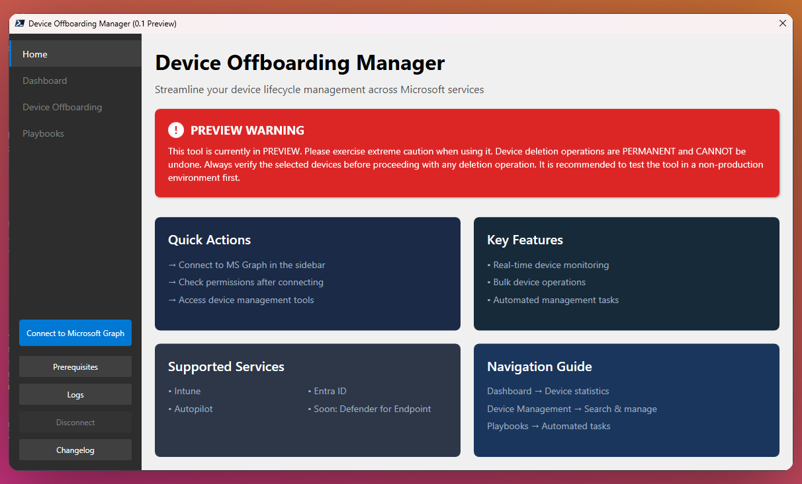
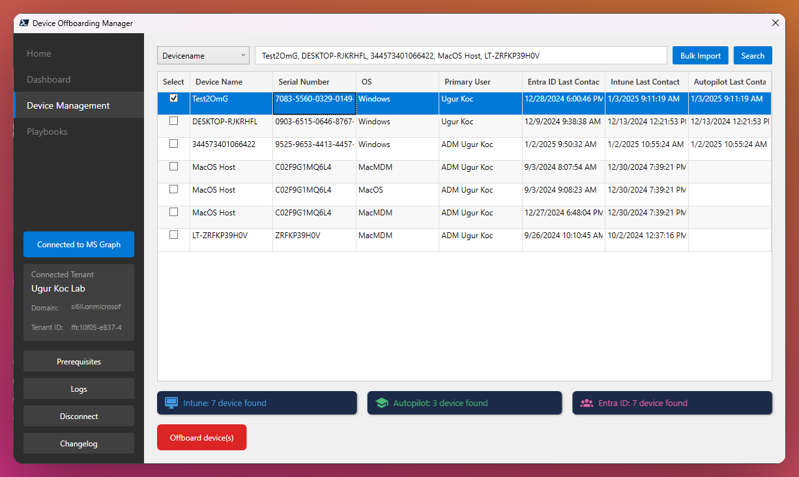
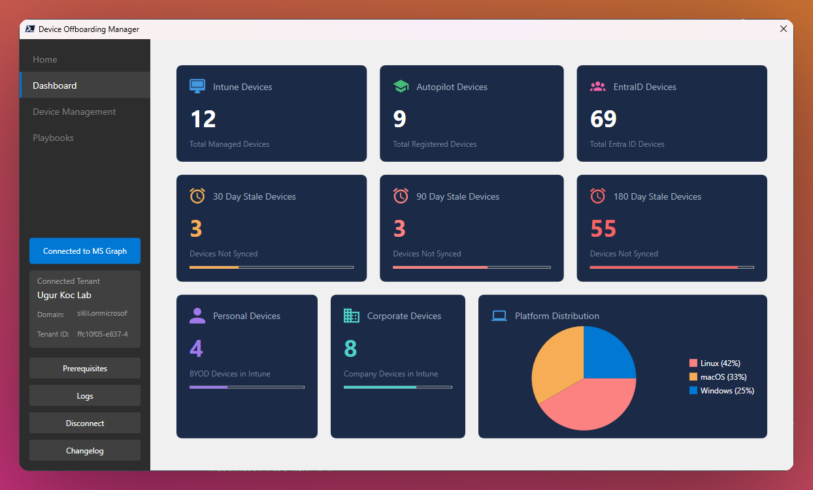

# Device Offboarding Manager

<div align="center">
  <p>
    <a href="https://twitter.com/UgurKocDe">
      
    </a>
    <a href="https://www.linkedin.com/in/ugurkocde/">
      
    </a>
    
  </p>
  <a href="https://www.powershellgallery.com/packages/IntuneAssignmentChecker">
      
    </a>
    <a href="https://www.powershellgallery.com/packages/IntuneAssignmentChecker">
      
    </a>
</div>

A modern PowerShell-based GUI tool for managing and offboarding devices from Microsoft Intune, Autopilot, and Entra ID (formerly Azure AD). This tool provides a streamlined interface for device lifecycle management across Microsoft services.



## Table of Contents

- [Device Offboarding Manager](#device-offboarding-manager)
  - [Table of Contents](#table-of-contents)
  - [🚀 Quick Start](#-quick-start)
    - [Option 1: Install from PowerShell Gallery (Recommended)](#option-1-install-from-powershell-gallery-recommended)
    - [Option 2: Manual Installation](#option-2-manual-installation)
  - [Features](#features)
    - [Core Functionality](#core-functionality)
    - [Device Management](#device-management)
    - [Dashboard Analytics](#dashboard-analytics)
    - [Playbooks](#playbooks)
  - [Prerequisites](#prerequisites)
  - [Usage](#usage)
    - [Authentication](#authentication)
    - [Device Management](#device-management-1)
    - [Dashboard](#dashboard)
    - [Playbooks](#playbooks-1)
  - [Contributing](#contributing)
  - [License](#license)

## 🚀 Quick Start

> **Important**: All commands must be run in a PowerShell 7 session. The script will not work in PowerShell 5.1 or earlier versions.

### Option 1: Install from PowerShell Gallery (Recommended)

```powershell
# Install from PowerShell Gallery
Install-PSResource DeviceOffboardingManager

# Open a new PowerShell 7 session to run the script with
DeviceOffboardingManager
```

If you encounter any issues during installation, try reinstalling:

```powershell
Install-PSResource DeviceOffboardingManager -Reinstall
```

To update to the latest version:

```powershell
Update-PSResource DeviceOffboardingManager
```

### Option 2: Manual Installation

```powershell
# Install Microsoft Graph Authentication Modul
Install-Module Microsoft.Graph.Authentication -Scope CurrentUser

# Download and run the script
.\DeviceOffboardingManager.ps1
```

## Features

### Core Functionality

- **Multi-Service Integration**: Manage devices across Intune, Autopilot, and Entra ID
- **Bulk Operations**: Support for bulk device imports and operations
- **Real-time Dashboard**: View device statistics and distribution
- **Secure Authentication**: Multiple authentication methods including interactive, certificate, and client secret

### Device Management



- Search devices by name or serial number
- View device details including:
  - Last contact times
  - Operating system
  - Primary user
  - Management status across services
- Bulk device offboarding with confirmation
- Automatic retrieval of BitLocker/FileVault keys

### Dashboard Analytics



- Total device counts per service
- Stale device tracking (30/90/180 days)
- Personal vs Corporate device distribution
- Platform distribution visualization
- Real-time statistics updates

### Playbooks


- Automated device management tasks
- Pre-built reports and analyses
- Custom playbook support for specific scenarios

## Prerequisites

1. PowerShell 5.1 or higher
2. Microsoft.Graph.Authentication module
3. Required Microsoft Graph API permissions:
   - Device.Read.All
   - DeviceManagementApps.Read.All
   - DeviceManagementConfiguration.Read.All
   - DeviceManagementManagedDevices.ReadWrite.All
   - DeviceManagementServiceConfig.ReadWrite.All
   - Group.Read.All
   - User.Read.All

## Usage

### Authentication

The tool supports three authentication methods:

1. **Interactive Login**: Best for admin users with appropriate permissions
2. **Certificate-based**: For automated or service principal authentication
3. **Client Secret**: Alternative service principal authentication method

To connect:

1. Click "Connect to MS Graph" in the sidebar
2. Choose your authentication method
3. Provide required credentials
4. Verify connection status in the tenant information section

### Device Management

1. **Search for Devices**:

   - Select search type (Device name/Serial number)
   - Enter search terms (supports multiple values with comma separation)
   - Click Search to retrieve device information

2. **Bulk Import**:

   - Click "Bulk Import"
   - Select a CSV/TXT file containing device names or serial numbers
   - Verify imported devices in the search field

3. **Device Offboarding**:
   - Select devices in the results grid
   - Click "Offboard device(s)"
   - Review the confirmation dialog
   - Note any encryption recovery keys
   - Confirm the operation

### Dashboard

The dashboard provides real-time insights into your device management environment:

- Device counts across services
- Stale device tracking
- Ownership distribution
- Platform distribution
- Quick access to common tasks

### Playbooks

Automated tasks for common scenarios:

- Find Autopilot devices not in Intune
- List Intune devices not in Autopilot
- Generate corporate device inventory
- View personal device inventory
- Analyze stale devices
- OS-specific device reports
- Encryption key reports

## Contributing

1. Fork the repository
2. Create a feature branch (`git checkout -b feature/AmazingFeature`)
3. Commit your changes (`git commit -m 'Add some AmazingFeature'`)
4. Push to the branch (`git push origin feature/AmazingFeature`)
5. Open a Pull Request

## License

This project is licensed under the MIT License - see the [LICENSE](LICENSE) file for details.
